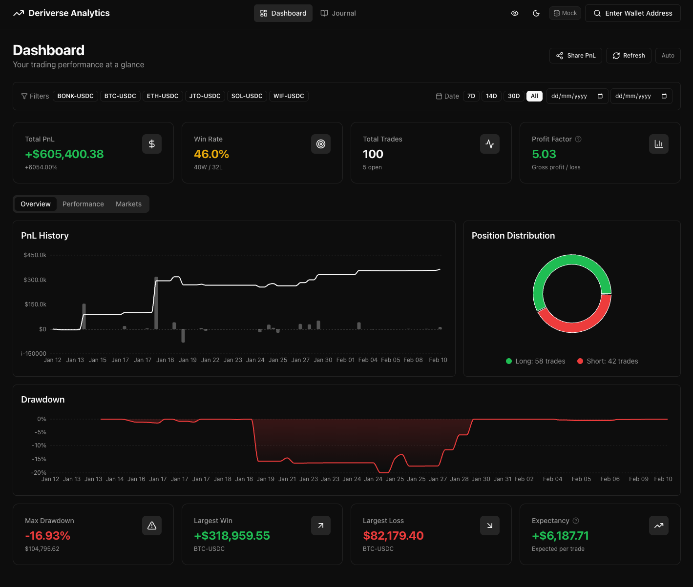

# Deriverse Analytics Dashboard

A comprehensive trading analytics dashboard for the [Deriverse](https://deriverse.io) perpetual DEX on Solana.



## 🚀 Features

### Dashboard
- **Real-time PnL Tracking** - Cumulative profit/loss visualization with daily bars
- **Win Rate Analysis** - Track your winning and losing trades
- **Drawdown Chart** - Monitor equity decline from peak
- **Position Distribution** - Long vs Short position breakdown
- **Hourly Performance** - See your best and worst trading hours
- **Market Breakdown** - PnL analysis by trading pair
- **Fee Analysis** - Trading and funding fee breakdown
- **Daily Calendar Heatmap** - GitHub-style performance visualization

### Trade Journal
- **Sortable Table** - Sort by date, market, PnL, and more
- **Advanced Filters** - Filter by market, side, status, and date range
- **Search** - Find trades by market or transaction hash
- **CSV Export** - Export your trade history for external analysis
- **Pagination** - Navigate through large trade histories

### Wallet Integration
- **Phantom & Solflare Support** - Connect your Solana wallet
- **Solana Explorer Links** - Direct links to transaction details

## 🛠️ Tech Stack

- **Framework**: Next.js 14 (App Router)
- **Language**: TypeScript
- **Styling**: Tailwind CSS + shadcn/ui
- **Charts**: Recharts
- **State**: Zustand (with persistence)
- **Solana**: @solana/wallet-adapter-react
- **SDK**: @deriverse/kit

## 📦 Installation

```bash
# Clone the repository
git clone https://github.com/yourusername/deriverse-analytics.git
cd deriverse-analytics

# Install dependencies
npm install

# Copy environment variables
cp .env.example .env.local

# Run development server
npm run dev
```

## 🔧 Environment Variables

```env
# Solana Network
NEXT_PUBLIC_SOLANA_NETWORK=devnet
NEXT_PUBLIC_RPC_URL=https://api.devnet.solana.com

# Deriverse
NEXT_PUBLIC_DERIVERSE_PROGRAM_ID=Drvrseg8AQLP8B96DBGmHRjFGviFNYTkHueY9g3k27Gu
```

## 📁 Project Structure

```
src/
├── app/
│   ├── page.tsx          # Dashboard page
│   ├── journal/page.tsx  # Trade journal page
│   ├── layout.tsx        # Root layout
│   └── providers.tsx     # Wallet & Query providers
├── components/
│   ├── dashboard/        # Chart components
│   ├── journal/          # Table & filter components
│   ├── layout/           # Header, navigation
│   └── wallet/           # Wallet connection
├── lib/
│   ├── analytics/        # Calculation utilities
│   └── mock/             # Mock data generator
├── stores/
│   └── tradeStore.ts     # Zustand state management
└── types/
    └── index.ts          # TypeScript definitions
```

## 🎯 Competition Criteria

This dashboard was built for the Deriverse Analytics Competition, focusing on:

1. **Comprehensiveness** - Full trading metrics coverage
2. **Accuracy** - Precise PnL and analytics calculations
3. **Clarity** - Clean, intuitive UI design
4. **Innovation** - Calendar heatmap, hourly analysis
5. **Code Quality** - TypeScript, modular architecture
6. **Security** - Read-only operations, no private key access

## 📊 Analytics Calculations

- **Win Rate**: `winningTrades / totalClosedTrades * 100`
- **Profit Factor**: `grossProfit / grossLoss`
- **Expectancy**: `(winRate * avgWin) - (lossRate * avgLoss)`
- **Max Drawdown**: Largest peak-to-trough equity decline
- **Risk/Reward**: `averageWin / averageLoss`

## 🚢 Deployment

```bash
# Build for production
npm run build

# Deploy to Vercel
vercel --prod
```

## 📝 License

MIT License - see [LICENSE](./LICENSE) for details.

## 🙏 Acknowledgments

- [Deriverse](https://deriverse.io) - Perpetual DEX on Solana
- [shadcn/ui](https://ui.shadcn.com) - UI components
- [Recharts](https://recharts.org) - Chart library
